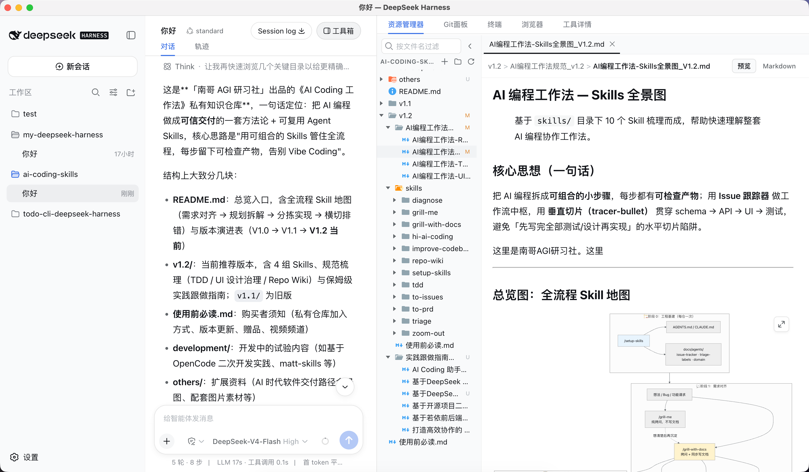
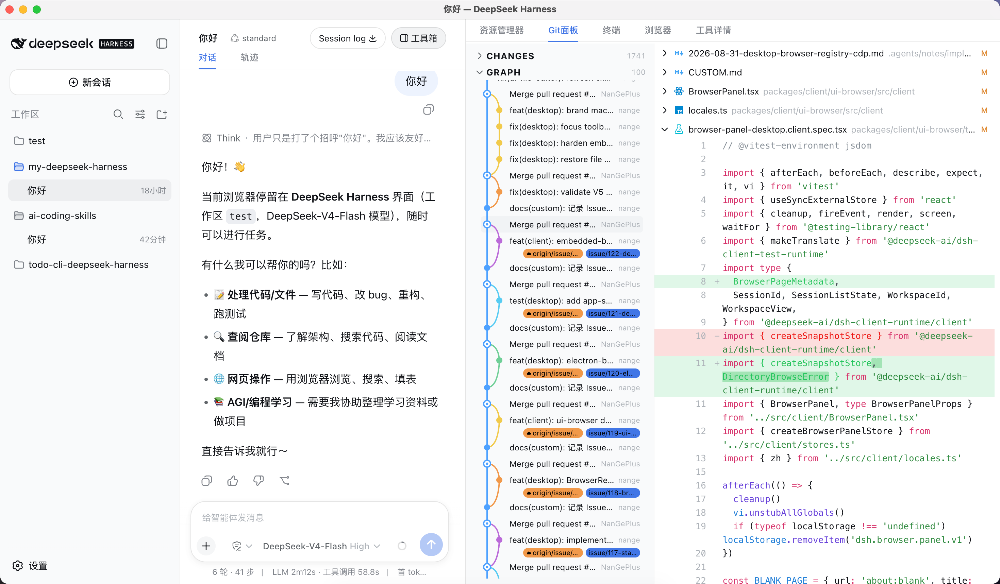
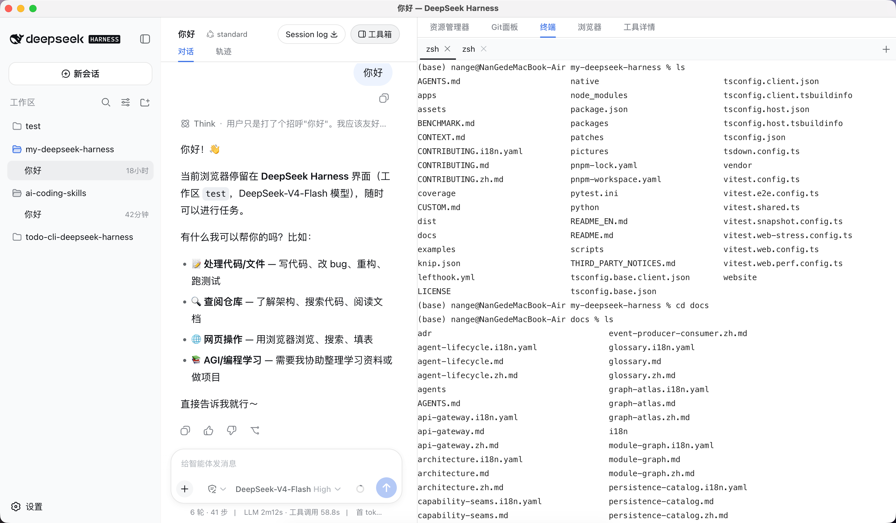
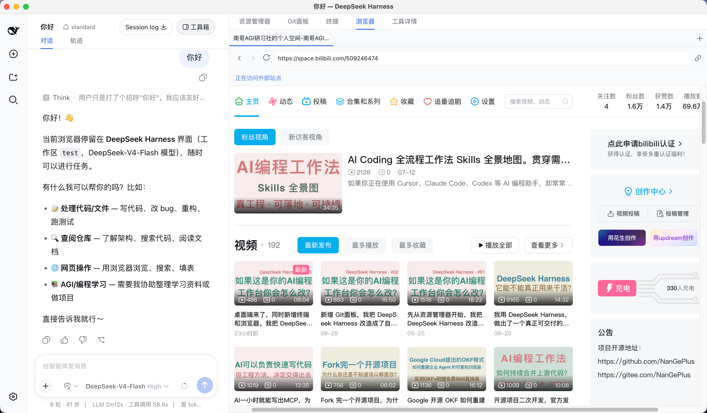

# NanGeAGI

**基于 [DeepSeek Harness](https://github.com/deepseek-ai/deepseek-harness) 的开源 AI Coding 工作台**

在浏览器或桌面 App 中与 Agent 对话，并在同一界面完成文件编辑、Git、终端与网页预览——无需在 IDE、终端与浏览器之间来回切换。

 

[English](README_EN.md) · 定制说明：[CUSTOM.md](CUSTOM.md)






---

## AI Coding Skills

本仓库的工具箱五段（资源管理器 → Git → 终端 → 浏览器 → 桌面壳）是一次完整的 **DeepSeek Harness 二开**实践，整个迭代过程，依然是按照可控 AI Coding 的节奏来走：需求对齐、规划拆解、分步实现、排错修复、架构维护。

从领域词汇、 PRD、Issue 切片到 Host RPC 与 Client 插件，全程在 **AI Coding Skills**下与 Agent 协作完成——而非「纯 vibe coding」式改代码。每个模块单独规划、单独落地，确保项目功能不断扩展的同时，整体结构依然保持清晰。

**AI Coding Skills 获取**


| 渠道      | 链接                                                                                                                                                                                                       |
| ------- | -------------------------------------------------------------------------------------------------------------------------------------------------------------------------------------------------------- |
| B 站     | [AI Coding Skills 获取（B 站）](https://mall.bilibili.com/neul-next/detailuniversal/detail.html?page=detailuniversal_detail&itemsId=41424824&loadingShow=1&noTitleBar=1#noReffer=true&msource=merchant_share) |
| Patreon | [AI Coding Skills 获取（Patreon）](https://www.patreon.com/nangeagi/posts/ni-shi-bu-shi-ye-166882633?utm_medium=clipboard_copy&utm_source=copyLink&utm_campaign=postshare_creator&utm_content=join_link)     |


关于 AI Coding Skills 的介绍及使用方式，大家可参考：

B站视频链接：[https://www.bilibili.com/video/BV1zQNM6MEqf/](https://www.bilibili.com/video/BV1zQNM6MEqf/)

YouTube视频链接：[https://www.youtube.com/playlist?list=PLRsjhp02BBRE](https://www.youtube.com/playlist?list=PLRsjhp02BBRE)

关于本项目介绍视频：               
#01 资源管理器视频：[B站](https://www.bilibili.com/video/BV1UPhu6JEuG/) [YouTube](https://youtu.be/OQCLfUDIdO0)                
#02 Git 面板视频：[B站](https://www.bilibili.com/video/BV159466kEiZ/) [YouTube](https://youtu.be/1165WCro46k)                  
#03 终端、浏览器和桌面端视频：[B站](https://www.bilibili.com/video/BV1D2tL6PEiy/) [YouTube](https://youtu.be/X098a4RVX90)                

---


## 能力概览


### Agent 平台（继承 DeepSeek Harness）


| 能力               | 说明                                        |
| ---------------- | ----------------------------------------- |
| **多会话 Agent 对话** | 流式回复、上下文与 Token 用量可见                      |
| **Workspace**    | 绑定本地项目目录，Agent 在该目录内读写与执行                 |
| **工具调用**         | 文件、Shell、Web 搜索、子 Agent、Todo、Plan、浏览器自动化等 |
| **权限与审批**        | 敏感操作可配置确认策略                               |
| **模型配置**         | DeepSeek API；设置页支持 OpenAI 兼容端点            |
| **Cordis 插件架构**  | 可按需扩展 Host / Client 能力                    |


### 本仓库定制：工具箱五段

Harness 原右侧 **详情栏**（details）在本 fork 中统一称为 **工具箱**。会话头 **图标 +「工具箱」** 胶囊按钮打开/收起，面板可拖宽。


| 段          | 模块      | 要点                                                                           |
| ---------- | ------- | ---------------------------------------------------------------------------- |
| **资源管理器**  | 文件编辑器   | Monaco 多 Tab、Markdown 预览/源码、语法高亮、LSP 诊断、显式保存、Git 行尾徽章、拖拽移动                   |
| **Git 面板** | 源代码管理   | 变更列表与提交历史图、差异预览、按块暂存/丢弃、提交与推送、Git 操作守卫                                       |
| **终端**     | 人类终端    | 多 Tab 交互式 Shell（xterm），与 Agent `terminal_`* 工具**完全分离**                       |
| **浏览器**    | 内嵌浏览器   | 多 Tab 导航；Web 路径为有头 Chromium 窗口；桌面 App 为面板内 WebView；Agent `browser_`* 与人类共用实例 |
| **工具详情**   | Tool 输出 | 查看 Agent 工具调用详情；点击消息流工具行可跳转                                                  |


### 对话区增强

- Mermaid 图表渲染与缩放预览
- Markdown / 图片 ZoomPan 浏览
- 选区 **Add to Chat**、已发送消息中的文件路径可打开编辑器


### 两种交付方式（均从源码启动）


| 方式         | 启动命令                                        | 说明                                                 |
| ---------- | ------------------------------------------- | -------------------------------------------------- |
| **Web**    | `pnpm dsh web`                              | 浏览器打开终端输出的 loopback 地址                             |
| **桌面 App** | `pnpm run dev:desktop` 或 `pnpm dsh desktop` | Electron 壳 + 同一 SPA；日常开发推荐 `dev:desktop`（Vite HMR） |


桌面与 Web **功能对等**（同一 SPA + 同一 Host 能力）；桌面通过 Electron IPC 连接本机 Host，不占用 loopback HTTP 端口。

---


## 安装与运行

**前置**

- Node.js `^22.19` 或 `>=24`
- pnpm `11.7.0`（Corepack）
- [Git](https://git-scm.com/)（Git 面板需要，须在 PATH 中）
- 模型 API Key（应用内 **设置 → 模型** 配置）

**克隆与构建**

```sh
git clone https://github.com/NanGePlus/my-deepseek-harness.git
cd my-deepseek-harness
git checkout custom/main

corepack enable
pnpm install
pnpm run build
```

**启动 Web（浏览器交付）**

```sh
pnpm dsh web
```

浏览器打开终端输出的地址（通常为 `http://127.0.0.1:3080`）。改动了 Client 插件 UI 后请硬刷新（`Cmd/Ctrl+Shift+R`）。

**启动桌面 App（Electron）**

```sh
pnpm run dev:desktop    # 推荐：Vite HMR + Electron
# 或
pnpm dsh desktop        # 使用已构建产物启动
```

**更新本地副本**

```sh
git pull && pnpm install && pnpm run build
# 若只改了 Client 插件 UI，bundle 对应包后重启 / 硬刷新
```


| 现象                                  | 处理                                           |
| ----------------------------------- | -------------------------------------------- |
| 官方 `npx @deepseek-ai/dsh web` 无定制功能 | 须从本仓库构建并 `pnpm dsh web`                      |
| 看不到「工具箱」或五段 Tab                     | 确认在 `custom/main` 且已 `pnpm run build`；硬刷新    |
| Client UI 改动不生效                     | `pnpm --filter <包名> run bundle` 后重启 web 或硬刷新 |
| 资源管理器：文件过大 / 目录「…」                  | 单文件约 5 MB；单层目录 listing 上限 1000 条             |


---


## 基本使用

1. **配置模型** — 设置 → 模型，填入 API Key（详见 [模型提供方指南](docs/user/guide/providers.zh.md)）。
2. **选择 Workspace** — 添加并选中项目根目录；文件树、Git、终端、浏览器均绑定该 Workspace。
3. **与 Agent 协作** — 在会话中描述任务（建议配合 **AI Coding Skills**，见上文 [AI Coding Skills](#ai-coding-skills)）；Agent 可通过工具读写仓库、执行命令、浏览网页。
4. **人类并行操作** — 工具箱内自行编辑文件（⌘S / Ctrl+S 保存）、管理 Git、开 Shell、预览页面。
5. **查看工具输出** — 工具箱 **工具详情**，或点击消息流中的工具行。

**守卫规则**：存在未保存的编辑器 Tab 时，切换 Session 或退出桌面 App 会提示保存/丢弃；运行中的终端或浏览器 Tab **不会**阻断切换。

---


## 架构简述

```text
交付层
  ├─ 桌面 App（Electron · desktop profile · IPC）
  └─ Web（dsh web · web profile · HTTP + SSE/WebSocket）

Host（Node）
  ├─ Agent 运行时（会话 · 工具 · LLM · 子 Agent …）
  └─ apiproxy RPC（文件 · Git · 终端 · Playwright 浏览器 · LSP …）

Web Client（浏览器 / Electron Renderer）
  ├─ 对话区（ui-conversation）
  └─ 工具箱
       ├─ ui-file-editor   资源管理器
       ├─ ui-git           Git 面板
       ├─ ui-terminal      人类终端
       ├─ ui-browser       浏览器
       └─ ui-tool          工具详情
```

扩展与上游架构见 [docs/architecture.zh.md](docs/architecture.md)（英文）与 [AGENTS.md](AGENTS.md)。

---


## 开发与构建

```sh
pnpm install
pnpm run build              # Host + Web 前端
pnpm dsh web                # Web 交付
pnpm run dev:desktop        # 桌面开发（HMR）
pnpm run test:gui           # Client / Host GUI 单元测试
```

仅改 Client 插件 UI 时，需先 bundle 对应包再重启或硬刷新，例如：

```sh
pnpm --filter @deepseek-ai/dsh-client-ui-conversation run bundle
pnpm --filter @deepseek-ai/dsh-client-ui-file-editor run bundle
```

集成线与上游差异见 [CUSTOM.md](CUSTOM.md)。领域词汇见 [CONTEXT.md](CONTEXT.md)。继续二开或修 bug 时，沿用 [AI Coding Skills](#ai-coding-skills) 与 Skills，在 `pnpm dsh web` 或 `pnpm run dev:desktop` 会话中迭代。

---


## 已知限制

- 基于 DeepSeek Harness 的 **fork**；合并上游需手动对齐（集成分支 `custom/main`）。
- 文件编辑器**无自动保存**；单文件约 5 MB 上限；单层目录 listing 上限 1000 条（超出显示 `…`）。
- Linux 桌面壳不在 V5 范围；Linux 上可从源码 `pnpm dsh web` 使用 Web 交付。
- 桌面壳 V5 **不含**自动更新、多窗口、远程 Host 一体启动等能力。
- 官方 `npx @deepseek-ai/dsh web` **不包含**本仓库工具箱定制，须从本仓库构建运行。

---


## 文档


| 文档                                                                     | 内容                       |
| ---------------------------------------------------------------------- | ------------------------ |
| [CUSTOM.md](CUSTOM.md)                                                 | Fork 定制台账与变更记录           |
| [CONTEXT.md](CONTEXT.md)                                               | 领域语言（工具箱、绑定 Workspace 等） |
| [docs/prd/](docs/prd/)                                                 | 各模块产品规格（V1–V5）           |
| [docs/adr/](docs/adr/)                                                 | 架构决策记录                   |
| [DeepSeek Harness 文档](https://github.com/deepseek-ai/deepseek-harness) | 上游平台与插件开发                |


---


## 许可证

[MIT](LICENSE) · 基于 [DeepSeek Harness](https://github.com/deepseek-ai/deepseek-harness) · 第三方组件见 [THIRD_PARTY_NOTICES.md](THIRD_PARTY_NOTICES.md)

维护：[NanGePlus/my-deepseek-harness](https://github.com/NanGePlus/my-deepseek-harness)
