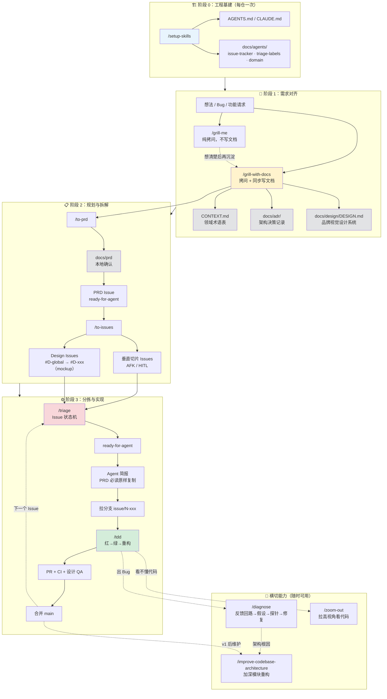
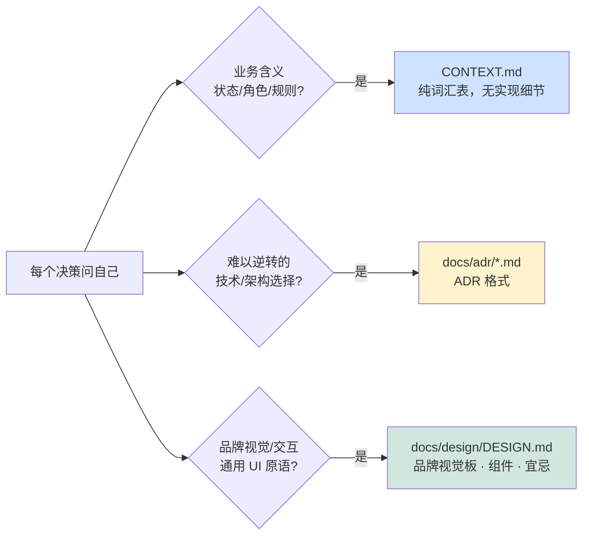
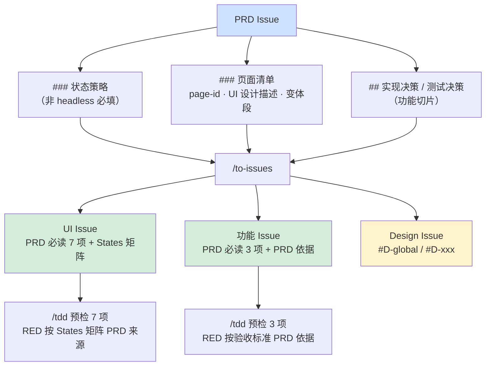
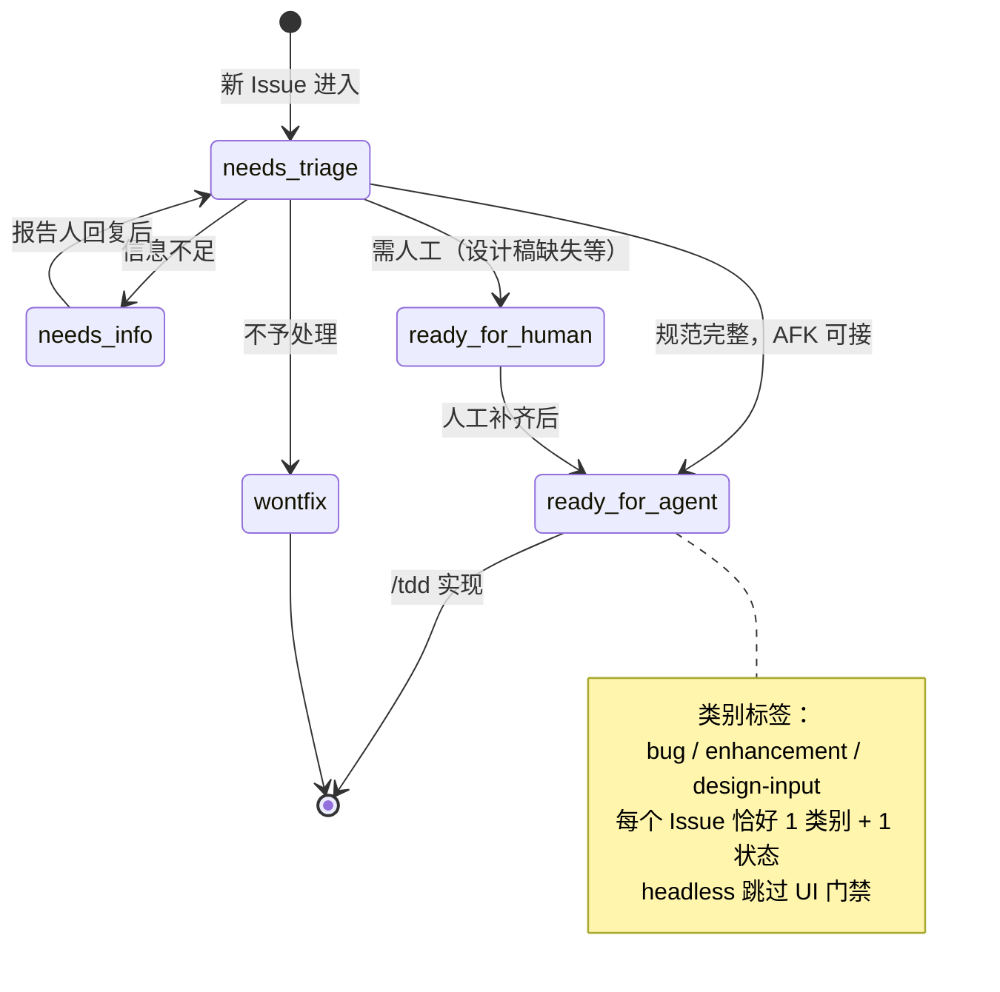

# AI 编程工作法 — Skills 全景图

## 总览图：全流程 Skill 地图

```mermaid
flowchart TB
    subgraph P0["🏗️ 阶段 0：工程基建（每仓一次）"]
        SETUP["/setup-skills"]
        SETUP --> AGENTS["AGENTS.md / CLAUDE.md"]
        SETUP --> DOCS_AGENTS["docs/agents/<br/>issue-tracker · triage-labels · domain"]
    end

    subgraph P1["💬 阶段 1：需求对齐"]
        IDEA["想法 / Bug / 功能请求"]
        GRILL_ME["/grill-me<br/>纯拷问，不写文档"]
        GRILL_DOCS["/grill-with-docs<br/>拷问 + 同步写文档"]
        IDEA --> GRILL_ME
        IDEA --> GRILL_DOCS
        GRILL_DOCS --> CTX["CONTEXT.md<br/>领域术语表"]
        GRILL_DOCS --> ADR["docs/adr/<br/>架构决策记录"]
        GRILL_DOCS --> DESIGN["docs/design/DESIGN.md<br/>品牌视觉设计系统"]
        GRILL_ME -.->|"想清楚后再沉淀"| GRILL_DOCS
    end

    subgraph P2["📋 阶段 2：规划与拆解"]
        TOPRD["/to-prd"]
        TOISS["/to-issues"]
        PRD_LOCAL["docs/prd<br/>本地确认"]
        PRD["PRD Issue<br/>ready-for-agent"]
        SLICES["垂直切片 Issues<br/>AFK / HITL"]
        D_ISSUES["Design Issues<br/>#D-global → #D-xxx（mockup）"]
        GRILL_DOCS --> TOPRD
        TOPRD --> PRD_LOCAL
        PRD_LOCAL --> PRD
        PRD --> TOISS
        TOISS --> SLICES
        TOISS --> D_ISSUES
    end

    subgraph P3["⚙️ 阶段 3：分拣与实现"]
        TRIAGE["/triage<br/>Issue 状态机"]
        READY["ready-for-agent"]
        BRIEF["Agent 简报<br/>PRD 必读原样复制"]
        BRANCH["拉分支 issue/N-xxx"]
        TDD["/tdd<br/>红→绿→重构"]
        PR["PR + CI + 设计 QA"]
        MERGE["合并 main"]
        SLICES --> TRIAGE
        D_ISSUES --> TRIAGE
        TRIAGE --> READY
        READY --> BRIEF
        BRIEF --> BRANCH
        BRANCH --> TDD
        TDD --> PR
        PR --> MERGE
        MERGE -.->|"下一个 Issue"| TRIAGE
    end

    subgraph P4["🔧 横切能力（随时可用）"]
        DIAG["/diagnose<br/>反馈回路→假设→探针→修复"]
        ZOOM["/zoom-out<br/>拉高视角看代码"]
        ARCH["/improve-codebase-architecture<br/>加深模块重构"]
    end

    P0 --> P1
    P1 --> P2
    P2 --> P3
    TDD -.->|"出 Bug"| DIAG
    DIAG -.->|"架构根因"| ARCH
    TDD -.->|"看不懂代码"| ZOOM
    MERGE -.->|"v1 后维护"| ARCH

    style SETUP fill:#e8f4fd
    style GRILL_DOCS fill:#fff3cd
    style TDD fill:#d4edda
    style TRIAGE fill:#f8d7da
    style CTX fill:#e2e3e5
    style ADR fill:#e2e3e5
    style DESIGN fill:#e2e3e5
    style PRD_LOCAL fill:#e2e3e5
```

```mermaid
flowchart LR
    Q["每个决策问自己"]
    Q --> Q1{"业务含义<br/>状态/角色/规则?"}
    Q --> Q2{"难以逆转的<br/>技术/架构选择?"}
    Q --> Q3{"品牌视觉/交互<br/>通用 UI 原语?"}

    Q1 -->|是| CTX["CONTEXT.md<br/>纯词汇表，无实现细节"]
    Q2 -->|是| ADR["docs/adr/*.md<br/>ADR 格式"]
    Q3 -->|是| DES["docs/design/DESIGN.md<br/>品牌视觉板 · 组件 · 宜忌"]

    style CTX fill:#cfe2ff
    style ADR fill:#fff3cd
    style DES fill:#d1e7dd
```

```mermaid
flowchart TB
    PRD["PRD Issue"]
    PRD --> ST["### 状态策略<br/>（非 headless 必填）"]
    PRD --> PL["### 页面清单<br/>page-id · UI 设计描述 · 变体段"]
    PRD --> ID["## 实现决策 / 测试决策<br/>（功能切片）"]

    TOISS["/to-issues"]
    ST --> TOISS
    PL --> TOISS
    ID --> TOISS

    TOISS --> UI["UI Issue<br/>PRD 必读 7 项 + States 矩阵"]
    TOISS --> FN["功能 Issue<br/>PRD 必读 3 项 + PRD 依据"]
    TOISS --> DI["Design Issue<br/>#D-global / #D-xxx"]

    UI --> TDD_UI["/tdd 预检 7 项<br/>RED 按 States 矩阵 PRD 来源"]
    FN --> TDD_FN["/tdd 预检 3 项<br/>RED 按验收标准 PRD 依据"]

    style PRD fill:#cfe2ff
    style UI fill:#d4edda
    style FN fill:#d4edda
    style DI fill:#fff3cd
```

```mermaid
stateDiagram-v2
    [*] --> needs_triage: 新 Issue 进入

    needs_triage --> needs_info: 信息不足
    needs_triage --> ready_for_agent: 规范完整，AFK 可接
    needs_triage --> ready_for_human: 需人工（设计稿缺失等）
    needs_triage --> wontfix: 不予处理

    needs_info --> needs_triage: 报告人回复后

    ready_for_agent --> [*]: /tdd 实现
    ready_for_human --> ready_for_agent: 人工补齐后
    wontfix --> [*]

    note right of ready_for_agent
        类别标签：
        bug / enhancement / design-input
        每个 Issue 恰好 1 类别 + 1 状态
        headless 跳过 UI 门禁
    end note
```
